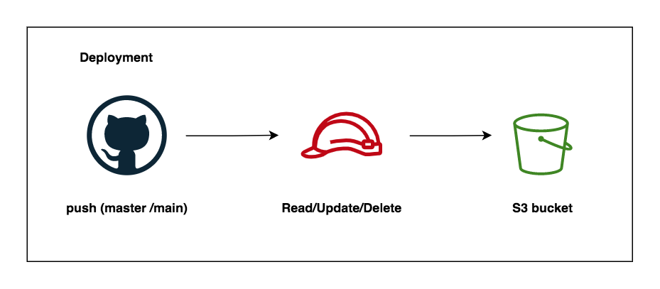
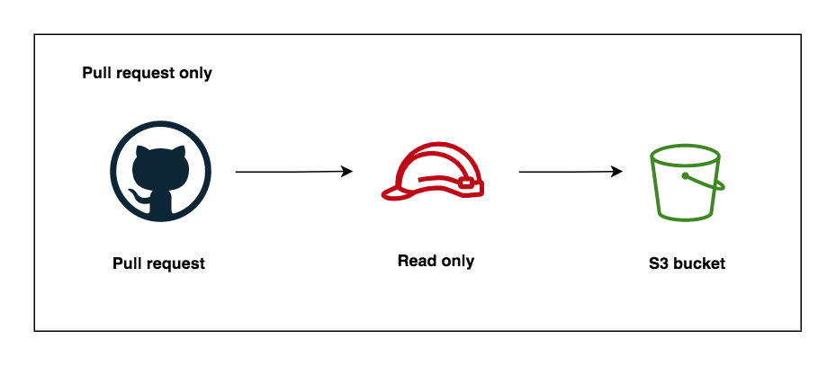

# Github OpenID connect with AWS (Granular permissions)

This is an example of Github Actions deployment to AWS with OpenID connect (OIDC) using terraform.

Building on our [example](https://github.com/Jareechang/github-oidc-example). We address a few problems related to permissions where it works for all workflows (pull requests, all branches and forks).

We want more granularity, which is what we are doing here.

## Changes

So, there are a few things we need to change:

- Create Separate the IAM roles (one for pull request, and deployment)
- Update our Subject filter and the condition operators
- Separate github actions workflows (pull request and deployment)

## Separate roles

### Deployment (write only)

### Pull request (read only)

## Full Tutorial

Full article available at [jerrychang.ca - Security harden Github Action deployments to AWS with OIDC](https://www.jerrychang.ca/writing/security-harden-github-actions-deployments-to-aws-with-oidc)
